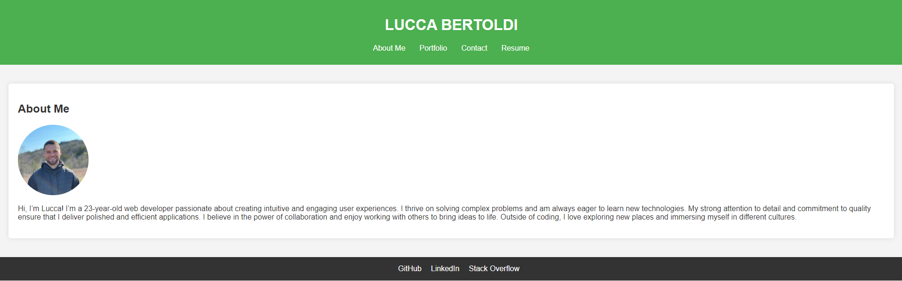
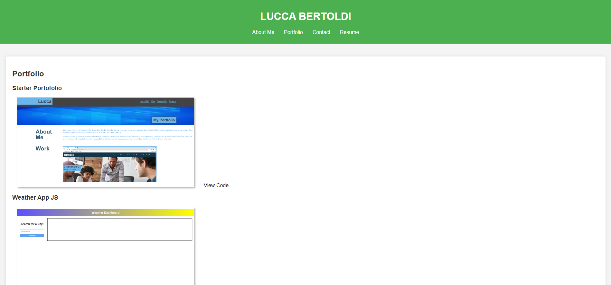
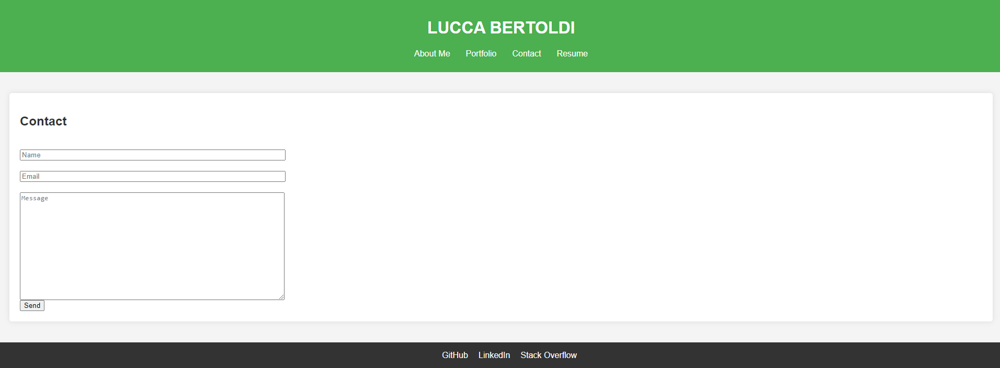
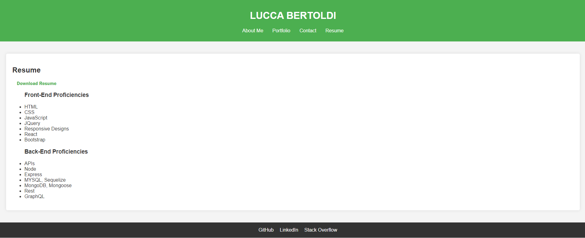

# React Portfolio

Welcome to my personal portfolio! This project showcases my work as a web developer and provides information about my skills, projects, and how to contact me.

## Table of Contents

- [Technologies Used](#technologies-used)
- [Features](#features)
- [Installation](#installation)
- [Usage](#usage)
- [License](#license)

## Technologies Used

This project is built using the following technologies:

- React
- React Router
- Vite

## Features

- **Responsive Design**: Optimized for various screen sizes.
- **Sections**:
  - **About Me**: A brief introduction and bio.
  - **Portfolio**: A showcase of my projects with links to live demos and source code.
  - **Contact**: A contact form to reach out to me.
  - **Resume**: A downloadable resume and a list of my proficiencies.
- **Navigation**: Smooth transitions between sections with highlighted active links.

## Installation

To get started with this project, follow these steps:

1. **Clone the repository**:
   git clone https://github.com/LuccaBertoldi/React-Portfolio
   cd React-Portfolio
   
2. **Install dependencies**:
    npm install
    
3. **Start the development server**:
    npm start
    Open your browser and navigate to http://localhost:3000

## Usage
You can view my portfolio in your web browser. Navigate through the sections using the links in the header.

## License
This project is licensed under the MIT License. See the LICENSE file for more information.

## Pictures 
Some Screenshots of the project:

